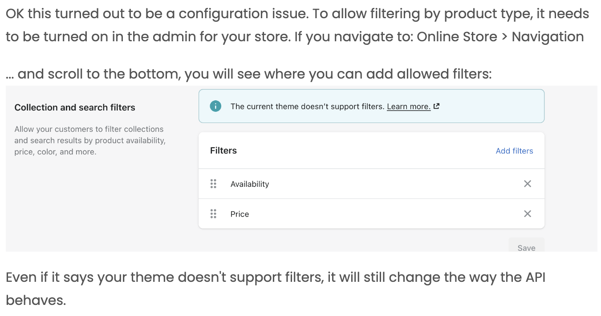

# shopify_flutter


A flutter package that works as a bridge between your Shopify Store and Flutter Application.

## How To Use

Create a private app on your Shopify store. Please follow [THIS DOC](https://shopify.dev/docs/storefront-api/getting-started) to get started with it.

While creating storefront api access token, makes sure to check all the api permissions as some queries and mutations require permission on objects like product tags.

First of all configure the ShopifyConfig like that:

```dart
void main() {
  
  ShopifyConfig.setConfig(
    storefrontAccessToken: '*******************',
    storeUrl: '*****.myshopify.com',

    // Optional | Needed only if needed to call admin api
    adminAccessToken: "shpat_*******************", 

    // optional | default: 2024-07
    storefrontApiVersion: '2024-07',

    // optional | default: null
    cachePolicy: CachePolicy.cacheAndNetwork,

     // Store locale | default : en
    language: 'en',
  );
  
  runApp(MyApp());
}
```

> `adminAccessToken` is only required for admin api calls like `deleteCustomer()`. 
If you are not using that function, you may not need to provide it.

> `storefrontApiVersion` default vesion is set to '2024-07'

> `language` defaults to 'en'. It is the default locale/language of the store. Only takes effect if the store supports provided language code.

<hr>

These are the five possible instances, each contains different methods which will help you with working with the Shopify Storefront API.

The goal is to make creating an mobile app from your Shopify website easier.

##### Shopify Auth
```dart
  ShopifyAuth shopifyAuth = ShopifyAuth.instance;

  Future<ShopifyUser> signInWithEmailAndPassword({required String email, required String password})
  Future<ShopifyUser> createUserWithEmailAndPassword({required String email, required String password, required String phone, String? firstName, String? lastName, bool? acceptsMarketing,})
  Future<void> signOutCurrentUser()
  Future<void> sendPasswordResetEmail({required String email})
  Future<ShopifyUser> currentUser({bool forceRefresh = false})
  Future<void> deleteCustomer({required String userId})
  Future<String?> get currentCustomerAccessToken
  Future<bool> get isAccessTokenExpired
  Future<AccessTokenWithExpDate?> get accessTokenWithExpDate
```

##### Shopify Store
```dart    
  ShopifyStore shopifyStore = ShopifyStore.instance;

  Future<List<Product>> getProductsByIds()
  Future<List<Product>> getXProductsAfterCursor(int limit,String startCursor)
  Future<List<Product>> getAllProducts()
  Future<List<Product>> getNProducts({required int n, required SortKey sortKey})
  Future<Shop> getShop()
  Future<Collection> getCollectionById(String collectionId)
  Future<List<Collection>> getAllCollections()
  Future<List<Product>> getAllProductsFromCollectionById(String id)
  Future<List<Product>> getAllProductsOnQuery(String cursor, SortKeyProduct sortKey, String query)
  Future<List<Product>> getXProductsOnQueryAfterCursor(String cursor, int limit, SortKeyProduct sortKey, String query)

  /// filters available queries
  Future<List<Product>> getXProductsAfterCursorWithinCollection(String id, int limit, String startCursor, SortKeyProduct sortKey, Map<String, dynamic>? filters)
  Future<List<Product>?> searchProducts(String query, {int limit = 15, String? startCursor, SearchSortKeys sortKey = SearchSortKeys.RELEVANCE, bool reverse = false, Map<String, dynamic>? filters})
```


##### ~~Shopify Checkout~~
###### Depreciated in Shopify API Version 2024-07. Use [ShopifyCart](#shopify-cart) Instead
```dart
  ShopifyCheckout shopifyCheckout = ShopifyCheckout.instance;~~

  Future<Checkout> getCheckoutInfoQuery({String checkoutId})
  Future<Checkout> getCheckoutInfoWithAvailableShippingRatesQuery({String checkoutId})
  Future<List<Order>> getAllOrders({String customerAccessToken})
  Future<void> checkoutLineItemsReplace({String checkoutId, List<Map<String,dynamic>> checkoutLineItems})
  Future<void> checkoutCustomerAssociate({String checkoutId, String customerAccessToken}) 
  Future<void> checkoutCustomerDisassociate({String checkoutId})
  Future<void> checkoutDiscountCodeApply({String checkoutId, String discountCode})
  Future<void> checkoutDiscountCodeRemove({String checkoutId})
  Future<Checkout> createCheckout()
  Future<void> checkoutGiftCardAppend(String checkoutId, List<String> giftCardCodes)
  Future<void> checkoutGiftCardRemove(String appliedGiftCardId, String checkoutId)
  Future<void> shippingLineUpdate(String checkoutId, String shippingRateHandle)
  Future<void> checkoutCompleteFree(String checkoutId)
  Future<void> updateAttributes(String checkoutId, {bool allowPartialAddresses, Map<String, String> customAttributes, String note})
  Future<Checkout> updateCheckoutEmail(String checkoutId, String email)
```

##### Shopify Cart
```dart
  ShopifyCart shopifyCart = ShopifyCart.instance;

  Future<Cart> getCartById(String cartId)
  Future<Cart> createCart(CartInput cartInput)
  Future<Cart> addLineItemsToCart({required String cartId, required List<CartLineInput> cartLineInputs})
  Future<Cart> removeLineItemsFromCart({required String cartId, required List<String> lineIds })
  Future<Cart> updateLineItemsInCart({ required String cartId, required List<CartLineInput> cartLineInputs })
  Future<Cart> updateNoteInCart({ required String cartId, required String note })
  Future<Cart> updateCartDiscountCodes({ required String cartId, required List<String> discountCodes })
  Future<Cart> updateBuyerIdentityInCart({ required String cartId, required CartBuyerIdentityInput buyerIdentity })
```

##### Shopify Order
```dart
  ShopifyOrder shopifyOrder = ShopifyOrder.instance;

  Future<List<Order>> getAllOrders({String customerAccessToken})
```

##### Shopify Customer
```dart
  ShopifyCustomer shopifyCustomer = ShopifyCustomer.instance;

  Future<void> customerAddressUpdate({String address1, String address2, String company, String city, String country, String firstName, String lastName, String phone, String province, String zip, String customerAccessToken, id})
  Future<void> customerUpdate({String email, String firstName, String lastName, String password, String phoneNumber, String customerAccessToken, bool acceptsMarketing})
  Future<void> customerAddressCreate({String address1, String address2, String company, String city, String country, String firstName, String lastName, String phone, String province, String zip, String customerAccessToken})
  Future<void> customerAddressDelete({String customerAccessToken, String addressId})
  Future<void> customerDefaultAddressUpdate({required String addressId, required String customerAccessToken})
```

##### Shopify Blog
```dart
  ShopifyBlog shopifyBlog = ShopifyBlog.instance;

  Future<List<Blog>> getAllBlogs()
  Future<Blog> getBlogByHandle(String handle, SortKeyArticle sortKeyArticle)
  Future<List<Article>> getXArticlesSorted({int articleAmount, SortKeyArticle sortKeyArticle})
```

##### Shopify Page
```dart
  ShopifyPage shopifyPage = ShopifyPage.instance;

  Future<List<Page>> getAllPages()
  Future<Page> getPageByHandle(String handle)
```

##### Shopify Localization

```dart
  ShopifyLocalization shopifyLocalizatoin = ShopifyLocalization.instance;

  Future<List<Page>> getLocalization()

  // Used to change currency units. eg: "US", "NP", "JP" etc. Only takes effect if the store supports provided currency.
  void setCountryCode(String? countryCode)

```

##### Shopify Custom
```dart
  ShopifyCustom shopifyCustom = ShopifyCustom.instance;

  Future<Map<String, dynamic>?> customQuery({required String gqlQuery, Map<String, dynamic> variables = const {}, bool adminAccess = false})
  Future<Map<String, dynamic>?> customMutation({required String gqlMutation, Map<String, dynamic> variables = const {}, bool adminAccess = false})
```

Above you see the instance on top and the possible methods and functions which you can use.

<hr>

### Filter Products

**filters** is a Map of String and dynmaic. Filter by `price` and `availability` are availabe by default.

Example:
```
  1. gets products with a price between 100 and 500
  {"price": {"min":100, "max":500} } 
  
  2. gets products with a price between 100 and 500 which are available
  {"price": {"min":100, "max":500}, "available": true} } 

  3. gets products with a variant option with name "color" and value "blue"
  { "variantOption": { "name": "color", "value": "blue" } } 
```

##### Configure Filters

  
For more information about filters visit:
  
  1. https://shopify.dev/docs/custom-storefronts/building-with-the-storefront-api/products-collections/filter-products#step-1-query-products
  
  2. https://shopify.dev/docs/api/storefront/2024-07/input-objects/productfilter

<hr>

#### Contribution

Everybody can contribute and is invited to do so!

**Important:** 
If you add a new field to a model please consider also adding this to every mutation/query that is associated with the model.

**Example:** Adding a new field to Checkout which is the webUrl, now you will need to go through the various queries/mutations and search for "Checkout" and add webUrl to each one of those.
(adding a new field to a Model also requires you to update the fromJson)
