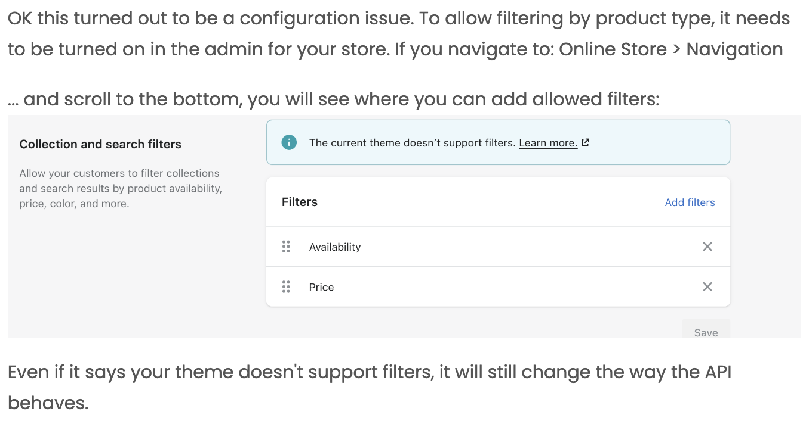

# shopify_flutter


A flutter package that works as a bridge between your Shopify Store and Flutter Application.

# Support

If you like the package and find it helpful, you can [Buy Me MO:MO](https://buymemomo.com/sujang). 

## How To Use

Create a private app on your Shopify store. Please follow [THIS DOC](https://shopify.dev/docs/storefront-api/getting-started) to get started with it.

While creating storefront api access token, makes sure to check all the api permissions as some queries and mutations require permission on objects like product tags.

First of all configure the ShopifyConfig like that:

```dart
void main() {
  
  ShopifyConfig.setConfig(
    storefrontAccessToken: '*******************',
    storeUrl: '*****.myshopify.com',

    // optional | default: 2026-07
    storefrontApiVersion: '2026-07',

    // optional | default: null
    cachePolicy: CachePolicy.cacheAndNetwork,

     // Store locale | default : en
    language: 'en',

    // optional | default: in-memory GraphQLCache()
    // Inject a custom GraphQLCache for the Storefront client (e.g. disk-backed
    // via HiveStore from graphql_flutter).
    storefrontCache: GraphQLCache(store: await HiveStore.open()),

    // optional | default: 30s
    queryRequestTimeout: const Duration(seconds: 30)
  );
  
  runApp(MyApp());
}
```

> **This package talks to the Storefront API only.** Admin API support was removed in 4.0.0: an Admin token grants broad read/write access to the whole shop and can be extracted from any distributed app binary, so it does not belong in a client. Perform admin operations (deleting a customer, reading shop settings, etc.) from your own backend.

> `storefrontApiVersion` default vesion is set to '2026-07'. This package requires **2026-07 or newer** (the cart operations rely on fields added in 2026-07). Shopify supports each version for 12 months after release and then falls forward to the oldest supported version, so prefer keeping this current.

> `language` defaults to 'en'. It is the default locale/language of the store. Only takes effect if the store supports provided language code.

> `storefrontCache` lets you supply a `GraphQLCache` from `graphql_flutter` so query results can be persisted to disk (e.g. via `HiveStore`) and survive app restarts. When omitted, fresh in-memory caches are created as before.

<hr>

These are the possible instances, each contains different methods which will help you with working with the Shopify Storefront API.

The goal is to make creating an mobile app from your Shopify website easier.

##### Error handling

Every method throws a `ShopifyException` when a call fails — whether Shopify
returned GraphQL/user errors, or the request never completed (no connectivity,
timeout, HTTP error). One `catch` covers both:

```dart
try {
  final products = await ShopifyStore.instance.getAllProducts();
} on ShopifyException catch (e) {
  // e.key       -> the operation, e.g. 'cartLinesAdd'
  // e.errorKey  -> the kind of error, e.g. 'userErrors'
  // e.errors    -> the messages Shopify returned
  print(e);
}
```

`ShopifyException` is exported from `package:shopify_flutter/shopify_flutter.dart`.

> **Changed in 3.1.0.** Failed requests previously threw a bare `String` — which
> is not an `Exception`, so `on Exception catch` did not catch it, and for
> connectivity errors the thrown value was an empty string with the real cause
> discarded. If you relied on catching a `String`, switch to `ShopifyException`.
> Code using a bare `catch (e)` keeps working.

##### Shopify Auth
```dart
  ShopifyAuth shopifyAuth = ShopifyAuth.instance;

  Future<ShopifyUser> signInWithEmailAndPassword({
    required String email, 
    required String password
  })

  Future<ShopifyUser> createUserWithEmailAndPassword({
    required String email, 
    required String password, 
    String? phone, 
    String? firstName, 
    String? lastName, 
    bool? acceptsMarketing
  })

  Future<void> signOutCurrentUser()

  Future<void> sendPasswordResetEmail({required String email})

  Future<ShopifyUser?> currentUser({bool forceRefresh = false})

  Future<String?> get currentCustomerAccessToken

  Future<bool> get isAccessTokenExpired

  Future<AccessTokenWithExpDate?> get accessTokenWithExpDate
```

##### Shopify Store
```dart    
  ShopifyStore shopifyStore = ShopifyStore.instance;

  Future<List<Product>> getProductsByIds(List<String> productIds)

  Future<List<Product>> getXProductsAfterCursor(
    int limit,
    String startCursor
  )

  Future<List<Product>> getAllProducts()

  Future<List<Product>> getNProducts({
    required int n, 
    required SortKey sortKey
  })

  Future<Shop> getShop()

  Future<Collection?> getCollectionById(String collectionId)

  Future<List<Collection>> getAllCollections()

  Future<List<Product>> getAllProductsFromCollectionById(String id)

  Future<List<Product>> getAllProductsOnQuery(
    String cursor, 
    SortKeyProduct sortKey, 
    String query
  )

  Future<List<Product>> getXProductsOnQueryAfterCursor(
    String cursor, 
    int limit, 
    SortKeyProduct sortKey, 
    String query
  )

  /// filters available queries
  Future<List<Product>> getXProductsAfterCursorWithinCollection(
    String id, 
    int limit, 
    String startCursor, 
    SortKeyProduct sortKey, 
    Map<String, dynamic>? filters
  )

  Future<List<Product>> searchProducts(
    String query, 
    {
      int limit = 15, 
      String? startCursor, 
      SearchSortKeys sortKey = 
      SearchSortKeys.RELEVANCE, 
      bool reverse = false, 
      Map<String, dynamic>? filters
    }
  )
```

Example to get metafields in product
```dart
      final products = await shopifyStore.getProductsByIds(
        [id],
        metafields: [
          MetafieldIdentifier(key: 'content-about-the-brand', namespace: 'pim'),
          MetafieldIdentifier(key: 'pdp_content_image_1_mobile', namespace: 'custom'),
          MetafieldIdentifier(key: 'pdp_content_image_2_mobile', namespace: 'custom'),
          MetafieldIdentifier(key: 'pdp_content_image_3_mobile', namespace: 'custom'),
          //...
        ],
      );
```

##### Shopify Cart
```dart
  ShopifyCart shopifyCart = ShopifyCart.instance;

  Future<Cart?> getCartById(String cartId, {bool reverse = false})

  Future<Cart> createCart(CartInput cartInput)

  Future<Cart> addLineItemsToCart({
    required String cartId, 
    required List<CartLineInput> cartLineInputs,
    bool reverse = false,
  })

  Future<Cart> removeLineItemsFromCart({
    required String cartId, 
    required List<String> lineIds,
    bool reverse = false,
  })

  Future<Cart> updateLineItemsInCart({ 
    required String cartId, 
    required List<CartLineInput> cartLineInputs,
    bool reverse = false,
  })

  Future<Cart> updateNoteInCart({ 
    required String cartId, 
    required String note,
    bool reverse = false,
  })

  Future<Cart> updateCartDiscountCodes({ 
    required String cartId, 
    required List<String> discountCodes,
    bool reverse = false,
  })

  /// Adds delivery addresses to an existing cart.
  /// Replaces the removed `buyerIdentity.deliveryAddressPreferences`.
  Future<Cart> addDeliveryAddresses({
    required String cartId,
    required List<CartSelectableAddressInput> addresses,
    bool reverse = false,
  })

  Future<Cart> updateBuyerIdentityInCart({ 
    required String cartId, 
    required CartBuyerIdentityInput buyerIdentity,
    bool reverse = false,
  })

  Future<Cart> updateCartAttributes({
    required String cartId,
    required List<AttributeInput> attributes,
    bool reverse = false,
  })
```

##### Shopify Order
```dart
  ShopifyOrder shopifyOrder = ShopifyOrder.instance;

  Future<List<Order>> getAllOrders({String customerAccessToken})
```

##### Shopify Customer
```dart
  ShopifyCustomer shopifyCustomer = ShopifyCustomer.instance;

  Future<void> customerAddressUpdate({
    required String customerAccessToken,
    required String id,
    String? address1, 
    String? address2, 
    String? company, 
    String? city, 
    String? country, 
    String? firstName, 
    String? lastName, 
    String? phone, 
    String? province, 
    String? zip, 
  })

  Future<void> customerUpdate({
    String? email, 
    String? firstName, 
    String? lastName, 
    String? password, 
    String? phoneNumber, 
    String? customerAccessToken, 
    bool? acceptsMarketing
  })

  Future<Address> customerAddressCreate({
    String? address1, 
    String? address2, 
    String? company, 
    String? city, 
    String? country, 
    String? firstName,
    String? lastName, 
    String? phone, 
    String? province, 
    String? zip, 
    String? customerAccessToken
  })


  Future<void> customerAddressDelete({
    String? customerAccessToken, 
    String? addressId
  })

  Future<void> customerDefaultAddressUpdate({
    required String addressId, 
    required String customerAccessToken
  })
```

##### Shopify Blog
```dart
  ShopifyBlog shopifyBlog = ShopifyBlog.instance;

  Future<List<Blog>> getAllBlogs()

  Future<Blog> getBlogByHandle(
    String handle, 
    SortKeyArticle sortKeyArticle
  )

  Future<List<Article>> getXArticlesSorted({
    int articleAmount, 
    SortKeyArticle sortKeyArticle
  })
```

##### Shopify Page
```dart
  ShopifyPage shopifyPage = ShopifyPage.instance;

  Future<List<Page>> getAllPages()

  Future<Page> getPageByHandle(String handle)
```

##### Shopify Localization

```dart
  ShopifyLocalization shopifyLocalizatoin = ShopifyLocalization.instance;

  Future<Localization> getLocalization()

  // Used to change currency units. eg: "US", "NP", "JP" etc. Only takes effect if the store supports provided currency.
  void setCountryCode(String? countryCode)

  // Used to set language code, eg: "EN", "DE", "FIL", "ZH_CN" etc.
  void setLanguageCode(String? languageCode)

  // Getters
  countryCode // get the stored country code
  languageCode // get the stored language code

```

##### Shopify Custom
```dart
  ShopifyCustom shopifyCustom = ShopifyCustom.instance;

  Future<Map<String, dynamic>?> customQuery({
    required String gqlQuery, 
    Map<String, dynamic> variables = const {}, 
  })

  Future<Map<String, dynamic>?> customMutation({
    required String gqlMutation, 
    Map<String, dynamic> variables = const {}, 
  })
```

Above you see the instance on top and the possible methods and functions which you can use.

<hr>

### Filter Products

**filters** is a Map of String and dynmaic. Filter by `price` and `availability` are availabe by default.

Example:
```
  1. gets products with a price between 100 and 500
  {"price": {"min":100, "max":500} } 
  
  2. gets products with a price between 100 and 500 which are available
  {"price": {"min":100, "max":500}, "available": true} } 

  3. gets products with a variant option with name "color" and value "blue"
  { "variantOption": { "name": "color", "value": "blue" } } 
```

##### Configure Filters

  
For more information about filters visit:
  
  1. https://shopify.dev/docs/custom-storefronts/building-with-the-storefront-api/products-collections/filter-products#step-1-query-products
  
  2. https://shopify.dev/docs/api/storefront/2026-07/input-objects/productfilter

<hr>

#### Contribution

Everybody can contribute and is invited to do so!

**Important:** 
If you add a new field to a model please consider also adding this to every mutation/query that is associated with the model.

**Example:** adding a new field to `Cart` means going through every cart query/mutation in `lib/graphql_operations/storefront/` and adding it to each one.
(adding a new field to a Model also requires you to update the fromJson)
